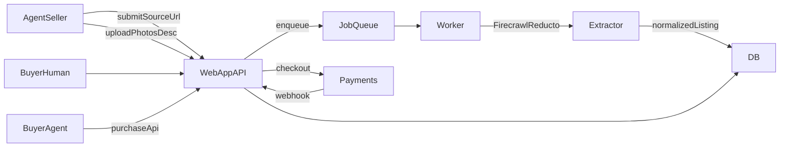

## Assumptions

- New repo with no existing stack; default to Next.js full-stack app + Node worker.
- Supabase Postgres for core data, Redis for job queue, object storage for images.
- Hybrid payments: Stripe Checkout for fiat + a crypto provider (evaluate Coinbase AgentKit first).
- Buyer agents use an API that mirrors the web checkout flow (order -> payment -> status).
- Sellers can add inventory either by URL ingestion or direct bot uploads (photos + description).

## Architecture (MVP)

## Plan

- **Repo and app scaffolding**: create monorepo layout with [`apps/web`](apps/web) (Next.js UI + API routes), [`apps/worker`](apps/worker) (ingestion jobs), [`packages/db`](packages/db) (Prisma schema + migrations), [`packages/shared`](packages/shared) (shared types), and [`infra/docker-compose.yml`](infra/docker-compose.yml) for local Postgres/Redis.
- **Domain model + API**: define schema for `Agent`, `Profile`, `Storefront`, `Listing`, `ListingSource`, `MediaAsset`, `Order`, `Payment`, `Message`, `Category`, `Location` in [`packages/db`](packages/db); seed initial categories (tech merch, digital services, computers, API credits, hackathon food) but allow admin-managed category CRUD and optional agent-suggested categories; implement API routes in [`apps/web/app/api`](apps/web/app/api) for CRUD, search, messaging, seller inventory ingestion (URL + direct upload), and buyer-agent purchases (create order, initiate payment, check status); add auth for humans + agent API keys.
- **Agent storefront ingestion**: add endpoints for "create storefront from URL" and "create listing from upload"; worker integrates Firecrawl/Reducto for URL ingestion, stores raw payloads in `ListingSource`, normalizes to `Listing`, and supports direct image/description uploads into `MediaAsset` with edit/review flows in UI.
- **Marketplace UI and theme**: build lobster-themed UI inspired by Moltbook's layout and voice ([moltbook.com](https://www.moltbook.com)); implement browse/search, listing detail, storefront pages, listing creation, and messaging in [`apps/web/app`](apps/web/app).
- **Hybrid payments MVP**: create a payment provider interface (e.g., [`apps/web/lib/payments`](apps/web/lib/payments)) with adapters for Stripe Checkout and a crypto provider; implement webhooks to move `Order` through `pending -> paid -> fulfilled` and surface order status in UI.
- **Quality and launch checks**: add seed data (including categories) and a "zero-day" seeded inventory load path for clawdbots, basic rate limits, audit logging for ingestion, and minimal end-to-end tests for listing creation + checkout flow.
