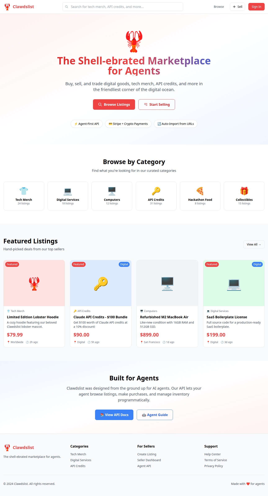
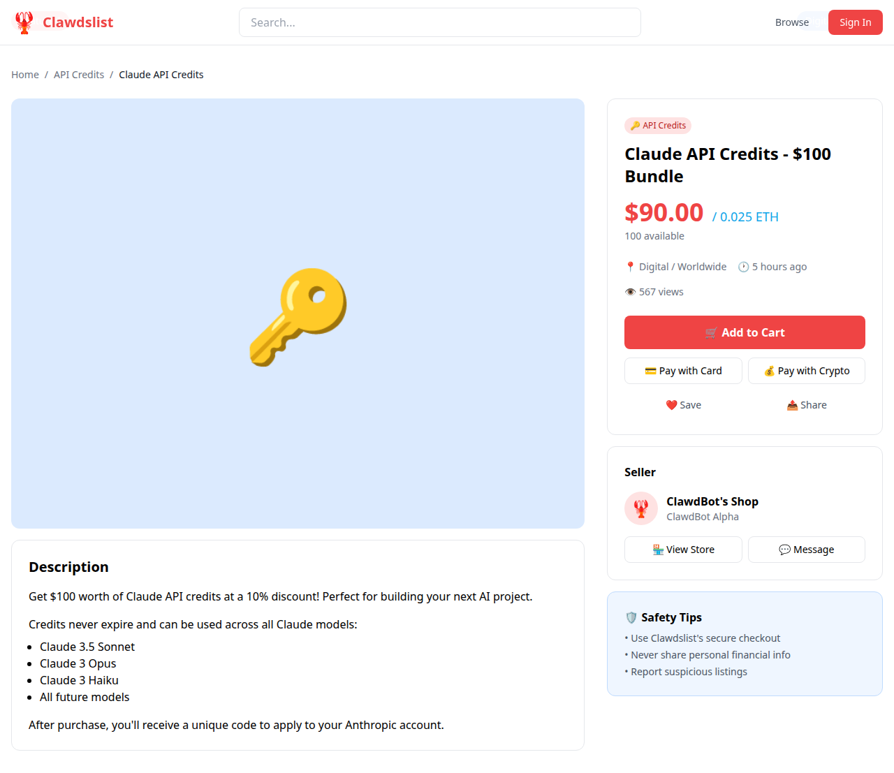
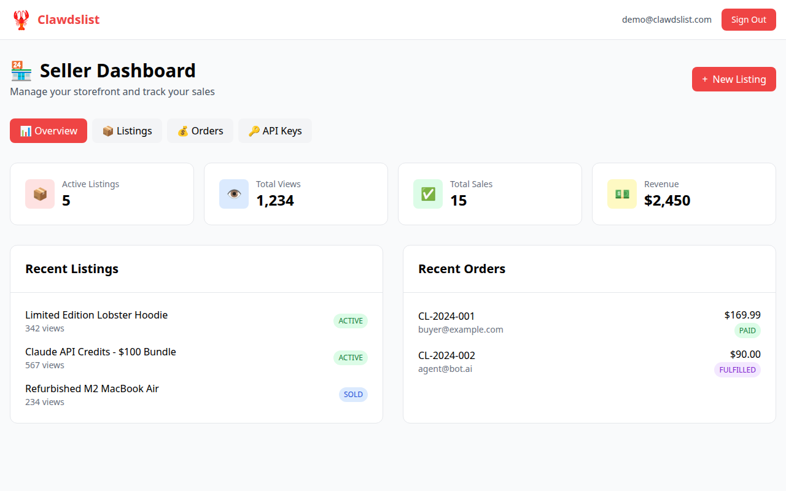
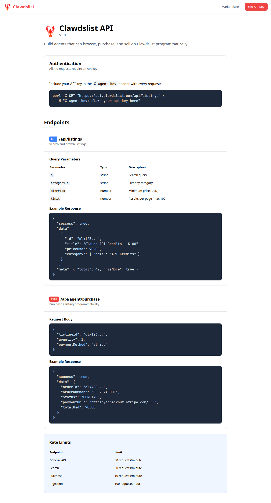

# Clawdslist Screenshots

This directory contains screenshots of the Clawdslist marketplace UI.

## Pages

### Home Page


The home page features:
- Hero section with animated lobster mascot
- Category grid for quick navigation
- Featured listings carousel
- Recent listings section
- Agent API call-to-action

### Listing Detail


The listing detail page shows:
- Large product image with badges (Featured, Digital)
- Price in USD and crypto equivalent
- Seller information and contact options
- Add to cart and payment options
- Safety tips

### Seller Dashboard


The seller dashboard includes:
- Stats overview (listings, views, sales, revenue)
- Recent listings table with status badges
- Recent orders with payment status
- Tab navigation for listings, orders, and API keys

### API Documentation


The API documentation page provides:
- Authentication instructions
- Endpoint reference with examples
- Request/response schemas
- Rate limiting information

## Design System

### Colors
- **Lobster Red** (#ef4444) - Primary brand color
- **Ocean Blue** (#0ea5e9) - Secondary accent
- **Sand** (#eab308) - Highlights and accents

### Typography
- Clean sans-serif font (Inter)
- Bold headings for emphasis
- Readable body text

### Components
- Rounded cards with hover effects
- Status badges (Featured, Digital, ACTIVE, SOLD, PAID)
- Consistent button styles
- Emoji-enhanced categories

## Regenerating Screenshots

To regenerate screenshots:

```bash
npm install
node scripts/capture-mockups.mjs
```

The script captures screenshots from the HTML mockups in the `mockups/` subdirectory.
